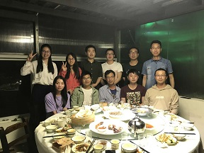
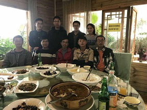

# 云南民族大学吴海锋团队

### About Us/关于团队

云南民族大学吴海锋教授团队名称为“云南省高校智能传感网络及信息系统科技创新团队”，前身为始建于2010年的云南民族大学“传感器网络技术与信息处理创新团队”，于2017年初获云南省教育厅立项，成为第五批云南省高等学校科技创新团队之一。

团队以云南民族大学电气信息工程学院为核心单位，紧密依托通信与信息工程一级学科硕士点发展，以立足云南省情、服务边疆民族的方针从事科学研究，围绕机器学习、神经信号处理、通信信号处理以及与云南密切相关的养路机械、物流系统等方面，采用信息化、网络化、智能化技术展开研究。

多年来，本团队始终坚持在科研和教学第一线，把提高科研教学质量作为重心。团队在提高科研质量的同时，不断跟踪学科的热点，取得了一系列的科研成果，团队学术研究气氛十分浓厚，近几年，团队在承担各类国家级、省部级科研项目数，发表SCI论文质量，获得奖项等方面均呈上升趋势。

### Team Leader/带头人

吴海锋，男，1977年6月生，云南昆明人，云南省中青年学术带头人，云南省高校智能传感网与信息系统创新团队带头人，云南民族大学特聘教授，云南省通信学会理事，近年来以第一作者和通信作者发表SCI二区以上论文十余篇，它引次数300余次，主持多项国家级、省级项目，曾主持获云南省自然科学奖三等奖.

主要经历 | 
------------ | -------------
2012/11至今| 云南民族大学, 电气信息工程学院,教授（破格）
2010/11~2012/10| 云南民族大学, 电气信息工程学院,副教授（破格）
2009/07~2010/10| 云南民族大学, 物电学院,讲师
2007/07~2009/07| 中山大学, 昆船博士后工作站,博士后
2004/09~2007/07| 中山大学, 信科学院,博士
2001/09~2004/07| 云南大学, 信息学院,硕士
1999/07~2001/02| 上海航天设备制造总厂,技术员
1995/09~1999/07| 南京理工大学, 制造工程学院,学士

# Research/科学研究

### Interest/研究方向

### Selected Publication/论文

- 2020
  - Haifeng Wu，Lingxu Kong，Yu Zeng, Han Bao, "Resting-state Brain Connectivity via Multivariate EMD in Mild Cognitive Impairment," IEEE Transactions on Cognitive and Developmental Systems, Early Access, 2021.([pdf](./paper/Proof_TCDS3054504.pdf), [code](https://github.com/monk5469/MEMD_MCI_fMRI))

- 2020
  - Junzhi Li, Haifeng Wu* and Yu Zeng, "Recovery of Collided RFID Tags With Frequency Drift on Physical Layer," IEEE/CAA J. Autom. Sinica, vol. 7, no. 6, pp. 1593-1603, Nov. 2020. ([pdf](./paper/JunZhi_jas.2019.1911720.pdf))
  - Jingyi Feng, Haifeng Wu, Yu Zeng, Yuhong Wang, “Weakly supervised learning in neural encoding for the position of the moving finger of a macaque”, Cognitive Computation, 12(5), Sep. 2020. ([pdf](./paper/Feng_weakly.pdf))
  - Haifeng Wu, Mingzhi Lu, Yu Zeng, State Estimation of Hemodynamic Model for fMRI Under Confounds: SSM Method, IEEE Journal of Biomedical and Health Informatics, 2020, 24(3):804-814. ([pdf](./paper/WuLu2019.pdf), [code](https://github.com/monk5469/CSCKF-CSCKS))

- 2019
  - Haifeng Wu, Jingyi Feng, and Yu Zeng, Neural Decoding for Macaque’s Finger Position: Convolutional Space Model, IEEE Transactions on Neural Systems and Rehabilitation Engineering, 2019, 27(3):543-551.  ([pdf](./paper/feng2019Trans.pdf))
  - Meng Gao， Haifeng Wu*, Yong Shen，Xia Wang，A peak detection algorithm adopting magnetic sensor signal for rail spike location in tamping machine, Advances in Mechanical Engineering, 2019, 11(11): 1-13. ([pdf](./paper/PeakDetection_Gao.pdf))
 
- 2018
  -  Haifeng Wu, K Yang, Y Zeng, Sparse Coding and Compressive Sensing for Overlapping Neural Spike Sorting, IEEE Transactions on Neural Systems and Rehabilitation Engineering, 2018, 26(8): 1516–1525. ([pdf](./paper/wu2018_SpikeSorting_trans.pdf)) 
  -  Haifeng Wu, Yang Wang, Yu Zeng, Capture-aware Bayesian RFID Tag Estimate for Large-scale Identification, IEEE/CAA Journal of Automatica Sinica, 2018 , 5(1) : 119-127. ([pdf](./paper/Capture-aware_AUTO.pdf))
  - 李俊志, 吴海锋*, 曾玉. 频率漂移的RFID冲突标签的物理层恢复 (Recovery of Collided RFID Tags with Frequency Drift on Physical Layer), 电子学报, 2018, 46 (8): 2004-2010 
  - 杨凯, 吴海锋*, 曾玉, 压缩感知的重叠神经元峰电位信号分类, 电子学报, 2018, 46 (3): 748-754

- 2017
  - 薛明龙, 吴海锋* , 曾玉, 无监督的猕猴运动皮层锋电位信号CKF解码 (Unsupervised CKF Decoding for Macaque Motor Cortical Spikes), 自动化学报, 2017, 43(2):302-312

- 2016
  - Hanjun Duan, Haifeng Wu * , Yu Zeng, Yuebin Chen, LS Channel Estimation and Signal Separation for UHF RFID Tag Collision Recovery on the Physical Layer, Sensors, 2016,  16(4):1-13. ([pdf](./paper/sensors-16-00442.pdf)) 
  - 王阳, 吴海锋* , 曾玉, 稠密RFID标签环境下捕获感知贝叶斯标签估计, 计算机研究与发展, 2016, 53(6):1325-1331 
  - 段汉俊, 吴海锋* , 曾玉, 物理层超高频射频识别标签信号分离中的信道估计, 电子与信息学报, 2016, 38(1):119-126 

- 2015
  - Haifeng Wu, Yu Zeng, Passive RFID Tag Anti-collision Algorithm for Capture Effect, IEEE Sensors Journal, 2015, 15(1): 218-226. ([pdf](./paper/Passive RFID Tag Anti-collision Algorithm for Capture Effect.pdf)) 
  - Yang Wang Haifeng Wu * , Yu Zeng, Capture-Aware Estimation for Large-scale RFID tags Identification, IEEE Signal Processing Letters, 2015, 22(9): 1274-1277. ([pdf](./paper/wang2015.pdf))
  - 吴海锋, 曾玉, 物理层的超高频RFID标签信号分离, 通信学报, 2015, 36(2):215-222

- 2010 ~ 2014
  - Haifeng Wu, Y. Zeng, J. Feng, Y. Gu,“Binary tree slotted aloha for passive RFID tag anti-collision,” IEEE Transactions Parallel and Distributed Systems, Vol. 24, no. 1, pp. 19-31, 2013. ([pdf](./paper/binary tree.pdf))
  - Haifeng Wu, Y. Zeng, “Efficient Framed Slotted ALOHA Protocol for RFID Tag Anti-collision,” IEEE Transactions Automation Science and Engineering, vol. 8, no. 3, pp. 581-588, 2011. ([pdf](./paper/efficient framed aloha.pdf))
  - Haifeng Wu, Y. Zeng, “Bayesian tag estimate and optimal frame length for anti-collision aloha RFID system,” IEEE Transactions Automation Science and Engineering, vol. 7, no. 4, pp. 963-969, 2010. ([pdf](./paper/Bayesian RFID Tag estimate.pdf))
  - Xi Yang, Haifeng Wu*, Yu Zeng, Fei Gao, “Capture-Aware Estimation for the Number of RFID Tags with Lower Complexity,” IEEE Communications Letters, Vol. 17, no. 10, pp 1873-1876, 2013. ([pdf](./paper/capture_aware.pdf))
  - 吴海锋, 曾玉, 凌永发. 捕获效应下RFID 标签的ABTSA 防冲突协议，自动化学报，40（3）：506-515, 2014 (EI)
  - 杨茜，吴海锋*, 曾玉. 捕获效应下RFID标签的CATPE防冲突协议，通信学报， 35(7):215~222, 2014 
  - 吴海锋，曽玉. 无需标签数估计的被动式RFID标签防冲突BTS协议,计算机研究与发展, 49（9）：1959-1971, 2012
  - 吴海锋，曽玉. 自适应帧ALOHA 的RFID 标签防冲突协议,计算机研究与发展,48（5）：802-811, 2011 
  - 吴海锋，曽玉. RFID 动态帧时隙ALOHA 防冲突中的标签估计和帧长确定,自动化学报，36 (4): 620-624, 2010

- Before 2010
  -  Haifeng Wu，X. Dai，H. Zhang. Semi-blind channel estimation for the uplink of MC-CDMA systems with timing offset, IET Communication, Vol.3, Iss.2,pp.185-197,2009
  - 吴海锋，戴宪华，梁建清. 带有时偏的MC-CDMA上行链路的盲信道估计，通信学报，28(1):8-16, 2007
 

### Grant/科研项目

- SSM视角下δ形传输拥塞的物理层解决:以UHF_RFID为例, 2018. 1 ~2021.12, 国家自然科学基金, 主持人：吴海锋 

- UHF_RFID的容迟性拥塞物理层解决：SSM模型方法, 2018. 4 ~2021. 4, 云南省应用基础研究重点项目, 主持人：吴海锋

- 云南省高校智能传感网络及信息系统科技创新团队, 2016.12 ~2019.12, 云南省高校科技创新团队建设项目, 主持人：吴海锋

- 云南省中青年学术带头人后备人才, 2014. 4 ~2017. 4, 云南省人才项目, 主持人：吴海锋

- 云南地区RFID物流供应链的仿生定位感知 MAC协议研究, 2013. 1 ~2016.12, 国家自然科学基金, 主持人：吴海锋

- 云南民族地区物流管理中多RFID标签冲突研究, 2011.10 ~2014. 9, 云南省应用基础研究面上项目, 主持人：吴海锋

# Fellowship/人才培养

  

- 硕士生
  - 2020级 保函，郭嘉雯，蒲长林，晏洁，高威
  - 2019级 桂妮霞, 罗金玲, 李栋
  - 2018级 陆小玲，孔伶旭，吴晓刚
  - 2017级 李毅，高萌，陈安莹
  - 2016级 冯景义，吴庆贺，鲁明志
  - 2015级 杨凯，李俊志
  - 2014级 薛明龙，刘汉军，院冬珠
  - 2013级 段汉俊，王阳
  - 2012级 朱芹，胡上贤
  - 2011级 杨茜
  - 2010级 谭元，刘静
  - 2009级 邓中婷
  
- 免试硕士生
  - 2020级 保函，郭嘉雯
  - 2019级 桂妮霞, 罗金玲
  - 2018级 陆小玲
  - 2011级 杨茜

# Course/主讲课程

### -通信系统仿真(研)
- [讲义及代码](./course/ComSim.rar)
### -现代信号处理
- [讲义](./course/SigProc.pdf) 
- [习题](./course/SigExercise.doc)
- [代码](./course/SigCode.rar) 
### -EDA
- [习题](./course/EDAExe.rar)
- [实验](./course/EDAExp.zip) 
### -DSP
- [习题](./course/DSPExe.rar)
- [实验](./course/DSPExp.zip) 

# What's New/最新动态

### Jan,2021
 祝贺孔伶旭论文被IEEE Transactions on Cognitive and Developmental Systems接受

Jun,2020. 祝贺桂妮霞获2020年云南省教育厅研究生科研基金项目资助

Jun,2020. 2020年云南民族大学“信息与通信工程”一级学科硕士校外调剂已经结束，复试结果已公示，敬请关注 [云南民族大学电电气信息工程学院](http://dxxy.ynni.edu.cn/)

May,2020. 祝贺高萌获得2020年云南民族大学“信息与通信工程”优秀硕士论文

Apr,2020. 祝贺冯景义获得2020年云南省首届研究生优秀成果奖

# Join Us/联系我们

联系人 | 吴老师
------------ | -------------
地址| 昆明市云南民族大学雨花校区电信学院
邮编| 650504
Email | whf5469@gmail.com

<!-- 不蒜子计数 -->

| 总访问量  次 
| 总访客数  人 
<!-- 不蒜子计数 -->

<!-- 不蒜子计数初始值纠正 -->

